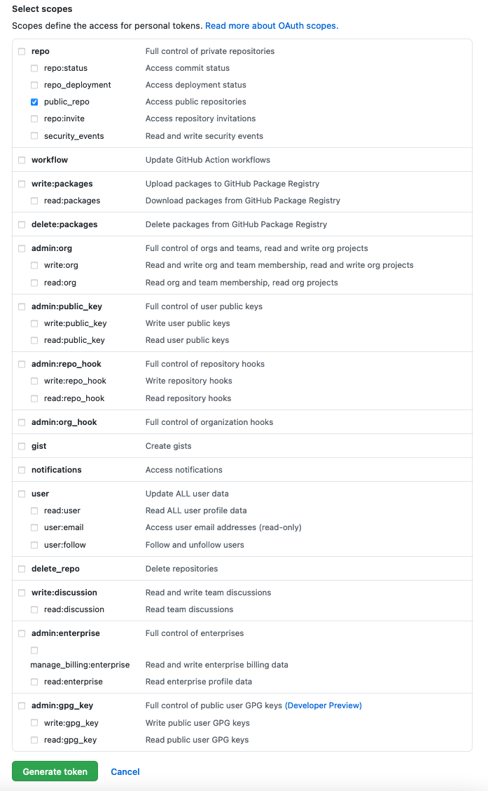

# K8s Docs PR Botherer

It bothers people who need to sign the CLA (automagically) in the Kubernetes Website repo by leaving the following comment (as you):

> "Hey there! (GITHUB USER), looks like you haven't signed the CLA yet. Could I please have you do that? https://github.com/kubernetes/community/blob/master/CLA.md"

## How to use:

### Get a Personal Access Token on GitHub

Following steps 1-10 here: https://help.github.com/articles/creating-a-personal-access-token-for-the-command-line/

In step 7 you'll want to give your token `public_repo` access only.



### Run the app

You'll need to fill in the `GITHUB_TOKEN=` with a personal access token you generate. 

Run with docker:

```shell
# The k8s-docs-pr-botherer image is <9 MB
docker run -e GITHUB_TOKEN='YOUR_NEW_GITHUB_TOKEN' quay.io/jimangel/k8s-docs-pr-botherer
```

Verify it worked by checking the last comment [a few PRs with no CLA signed](https://github.com/kubernetes/website/pulls?q=is%3Aopen+is%3Apr+label%3A%22cncf-cla%3A+no%22+-label%3A%22do-not-merge%2Fwork-in-progress%22+-label%3A%22do-not-merge%2Fhold%22+label%3Alanguage%2Fen).

### Other ways to run the app

I understand not everyone wants to run a random docker container. If you'd like to inspect `main.go` and run without docker, clone this repo and run:

```shell
$ go get ./...
$ GITHUB_TOKEN= go run main.go
```

## Publish your own image(s)

The multi-arch docker image I'm hosting is built using [ko](https://github.com/google/ko) using a free [quay.io](https://quay.io/) repository.

Export the repo:

```shell
# used by ko to build / publish
export KO_DOCKER_REPO="quay.io/jimangel/k8s-docs-pr-botherer"
```

Before building the images, makes sure `docker login` works to your repo (and you have write access).

Build the images (defaults to "latest" tag):

```shell
# create multi-platform image
ko publish --platform=all --bare .
```

## Security

It's important to understand the scope of permissions your token has, from the GH website, the `public_repo` scope:

> Limits access to public repositories. That includes read/write access to code, commit statuses, repository projects, collaborators, and deployment statuses for public repositories and organizations. Also required for starring public repositories.